# SEPA Stock Screener & VCP Analyzer

## Project Objective
To deliver a locally-runnable, containerized web application that helps users identify US stocks meeting Mark Minervini’s key quantitative Specific Entry Point Analysis (SEPA) criteria and visually analyze their Volatility Contraction Pattern (VCP) on an interactive chart.

## Last Updated
2025-12-21
docs: data_contracts.md, database_schema.md updated

## Key Features
- **Ticker Universe Generation:** Retrieves a comprehensive list of all US stock tickers (NYSE, NASDAQ, AMEX) via a dedicated Python service. 
- **Centralized Data Access & Caching**: The `data-service` acts as a data abstraction layer, fetching information from various external sources (e.g., Yahoo Finance, Finnhub). It provides a consistent internal API for other services and implements a Redis caching layer to minimize redundant API calls. It features a robust, centralized client for external Yahoo Finance requests, which implements an advanced retry and identity rotation policy (proxies, user agents, browser profiles) to ensure resilient and reliable data fetching. All data providers within the service route network I/O through this client for consistent behavior.
- **Quantitative Screening**: Screens stocks based on Mark Minervini's 8 Trend Template criteria.
- **VCP Analysis**: Algorithmically analyzes a stock's Volatility Contraction Pattern (VCP), identifies Flat Base structures for strong leaders, and flags actionable Pullback (PB) setups for post-breakout entries.
- **Leadership Screening**: Evaluates stocks against 9 "Leadership Profile" criteria, including EPS growth, market outperformance, and industry rank.
- **Market Health Dashboard:**: Visualizes overall market breadth (New Highs vs. Lows), correction depth, and tracks leading industries to determine the current market stage.
- **Smart Watchlist & Archive**: A feature-rich management system for candidate stocks. Includes automated "Freshness" health checks, Favorites pinning to prevent auto-deletion, Batch Actions for bulk management, and a searchable Archive ("Graveyard") to audit removed tickers.
- **Watchlist Refresh Orchestrator:** The monitoring-service owns an internal refresh pipeline that calls screening, analysis, and data services to update watchlist item statuses and archive failed items via a single internal endpoint.
- **Automatic Archive Expiry:** Archived watchlist entries are stored in MongoDB with a 30-day TTL index on their archived timestamp, automatically purging stale records without manual cleanup.
- **Dynamic Chart Visualization**: Displays charts with VCP trendlines, buy pivot points, and stop-loss levels.
- **Microservices Architecture:** A robust, containerized environment managed through a central API Gateway, all powered by Python.
- **Containerized Environment**: Fully containerized for consistent, one-command startup.

## Architecture Overview

```mermaid
graph LR
    subgraph User Interaction
        User[👩‍💻 User] --> FrontendApp[React Frontend];
    end

    subgraph Backend Infrastructure
        FrontendApp --> APIGateway[API Gateway];
        
        subgraph Orchestration
           Scheduler[Scheduler Service] --> TickerService;
           Scheduler --> ScreeningService;
           Scheduler --> AnalysisService;
           Scheduler --> LeadershipService;
           Scheduler --> MongoDB;
        end

        subgraph Core Services
            APIGateway --> TickerService[Ticker Service];
            APIGateway --> ScreeningService[Screening Service];
            APIGateway --> AnalysisService[Analysis Service];
            APIGateway --> LeadershipService[Leadership Service];
            APIGateway --> MonitoringService[Monitoring Service];
        end

        subgraph Data Layer
            APIGateway --> DataService[Data Service];
            ScreeningService -- "Requests data in chunks" --> DataService;
            DataService -- "Responds via /price/batch" --> ScreeningService;
            AnalysisService --> DataService;
            LeadershipService --> DataService;
            MonitoringService --> DataService;
            MonitoringService --> MongoDB;
            DataService <--> Redis[(Redis Cache)];
            DataService <--> MongoDB[(MongoDB Persistence)];
        end
    end

    style FrontendApp fill:#2dd4bf,stroke:#115e59,stroke-width:2px,color:#fff
    style APIGateway fill:#60a5fa,stroke:#1e40af,stroke-width:2px,color:#fff
    style Scheduler fill:#facc15,stroke:#713f12,stroke-width:2px,color:#000
```


**Screening & Data Service Communication:** The `screening-service` fetches data from the `data-service` in chunks using the `/price/batch` endpoint. This batching approach is more efficient than requesting data for each ticker individually, especially when screening a large number of stocks.

### Screenshots


## Quick Start

### Prerequisites
Ensure the following software is installed on your system:
- Git
- Docker
- Docker Compose (usually included with Docker Desktop)

### Installation & Setup
Follow these steps to set up and run the application locally:

1. **Clone the repository**:
   ```bash
   git clone https://github.com/lam200213/Catalyst-Engine.git
   cd Catalyst-Engine
   ```

2. **Create a `.env` file**:
   Copy the `.env.example` file to `.env` in the project root and add your Finnhub API key.
   In Linux and macOS environments:
   ```bash
   cp .env.example .env
   ```

   In Windows PowerShell
   ``` PowerShell
   Copy-Item .env.example .env
   ```

   Open `.env` and replace `YOUR_FINNHUB_API_KEY`, `YOUR_MARKETAUX_API_KEY`, `WEBSHARE_API_KEY` with your actual key if have. (Finnhub API key is only needed if you specifically request it as a data source; MARKETAUX API key is necessary for the news-fetching feature; WEBSHARE API key or other proxies are required for smooth pipeline screening experience)

3. **Run the application**:
   We use a Base + Override strategy for Docker Compose. Choose the command that fits your needs:
   - **Production Mode (Default)**:
   Uses static Nginx build for Frontend, no hot-reloading, restart policies enabled.
   ```bash
   # Method 1: Automatic Override (Recommended)
   # First time only: Create the override file to make prod mode the default
   cp docker-compose.prod.yml docker-compose.override.yml

   # Later on: Simply run this command for all future builds
   docker compose up --build -d

   # Method 2: Explicit File Selection
   # Use this if you prefer not to create an override file
   docker compose -f docker-compose.yml -f docker-compose.prod.yml up --build -d
   ```

   - **Development Mode (Default)**:
   Includes hot-reloading (volumes) and runs the Frontend via Vite dev server.
   ```bash
   # Method 1: Automatic Override (Recommended)
   # First time only: Create the override file to make dev mode the default
   cp docker-compose.dev.yml docker-compose.override.yml

   # Later on: Simply run this command for all future builds
   docker compose up --build -d

   # Method 2: Explicit File Selection
   # Use this if you prefer not to create an override file
   docker compose -f docker-compose.yml -f docker-compose.dev.yml up --build -d
   ```
   This command builds Docker images for each service and starts all containers.

4. **Access the application**:
   - **Frontend UI**: [http://localhost:5173](http://localhost:5173) (default port: 5173)
   - **API Gateway**: [http://localhost:3000](http://localhost:3000) (all API requests from the frontend are sent here)

5. **Stop the application**:
   To shut down the containers safely, use the command corresponding to your startup method:
   - **Method 1: Automatic Override**: 
   ```bash
   docker compose down
   ```
   - **Method 2: Explicit File Selection**: 
   If running in Development:
   ```bash
   docker compose -f docker-compose.yml -f docker-compose.dev.yml down
   ```
   If running in Production:
   ```bash
   docker compose -f docker-compose.yml -f docker-compose.prod.yml down
   ```
## Learn More
- [🔗 Detailed Architecture & Tech Stack](./docs/ARCHITECTURE.md)
- [📖 API Reference Guide](./docs/API_REFERENCE.md)
- [⚙️ Troubleshooting Guide](./docs/TROUBLESHOOTING.md)

## ⚠️ Disclaimer

### Not Financial Advice
- This application ("SEPA Stock Screener") is developed for educational and research purposes only. It implements quantitative screening criteria based on Mark Minervini's Specific Entry Point Analysis (SEPA) and Volatility Contraction Pattern (VCP) concepts. The results generated by this software do not constitute financial advice, investment recommendations, or a solicitation to buy or sell any securities.

### Data Accuracy & Reliability
- Third-Party Data: This application relies on external data providers (Yahoo Finance, Finnhub, Marketaux). The developers of this project have no control over the accuracy, timeliness, or availability of this data.

- Delays & Rate Limits: Free tier API keys and web scraping methods used by this project are subject to rate limits, outages, and data delays. Do not rely on this tool for real-time trading decisions.

- No Warranty: The software is provided "as is", without warranty of any kind, express or implied.

### Investment Risk
- Trading stocks and securities involves a significant risk of loss. Users should conduct their own due diligence and consult with a qualified financial advisor before making any investment decisions. The developers assume no liability for any financial losses incurred from the use of this software.