# SEPA Stock Screener & VCP Analyzer

## Project Objective
To deliver a locally-runnable, containerized web application that helps users identify US stocks meeting Mark Minervini’s key quantitative Specific Entry Point Analysis (SEPA) criteria and visually analyze their Volatility Contraction Pattern (VCP) on an interactive chart.

## Last Updated
2025-07-22
Updated test cases for api-gateway, data, schedular and ticker services

## Key Features
* **Ticker Universe Generation:** Retrieves a comprehensive list of all US stock tickers (NYSE, NASDAQ, AMEX) via a dedicated Python service. 
- **Modular Data Acquisition and Cachin g**: Utilizes a **Facade Pattern** in the `data-service` to fetch data from source (yfinance), and caches financial data (price/fundamentals from sources, news from MarketAux) to minimize redundant API calls.  
- **Quantitative Screening**: Screens stocks based on Mark Minervini's 8 Trend Template criteria.
- **VCP Analysis**: Algorithmically analyzes a stock's Volatility Contraction Pattern (VCP).
- **Dynamic Chart Visualization**: Displays charts with VCP trendlines, buy pivot points, and stop-loss levels.
* **Microservices Architecture:** A robust, containerized environment managed through a central API Gateway, all powered by Python.
- **Containerized Environment**: Fully containerized for consistent, one-command startup.

## Architecture Overview
**- Frontend App: The user interface...**
**- API Gateway: Routes all incoming...**
**- Scheduler Service: The Scheduler Service automates...**
**- Ticker Service: Provides the list...**
**- Data Service: The single source...**
**- Screening Service: Applies the 8...**
**- Analysis Service: Performs the VCP...**
**- MongoDB: Caching layer...**

```mermaid
graph LR
    subgraph User Interaction
        User[👩‍💻 User] --> FrontendApp[React Frontend];
    end

    subgraph Backend Infrastructure
        FrontendApp --> APIGateway[API Gateway];
        
        subgraph Orchestration
           Scheduler[Scheduler Service] --> TickerService;
           Scheduler --> ScreeningService;
           Scheduler --> AnalysisService;
           Scheduler --> MongoDB;
        end

        subgraph Core Services
            APIGateway --> TickerService[Ticker Service];
            APIGateway --> ScreeningService[Screening Service];
            APIGateway --> AnalysisService[Analysis Service];
        end

        subgraph Data Layer
            APIGateway --> DataService[Data Service];
            ScreeningService --> DataService;
            AnalysisService --> DataService;
            DataService <--> MongoDB[(MongoDB Cache)];
        end
    end

    style FrontendApp fill:#2dd4bf,stroke:#115e59,stroke-width:2px,color:#fff
    style APIGateway fill:#60a5fa,stroke:#1e40af,stroke-width:2px,color:#fff
    style Scheduler fill:#facc15,stroke:#713f12,stroke-width:2px,color:#000
```


### Screenshots


## Quick Start

### Prerequisites
Ensure the following software is installed on your system:
- Git
- Docker
- Docker Compose (usually included with Docker Desktop)

### Installation & Setup
Follow these steps to set up and run the application locally:

1. **Clone the repository**:
   ```bash
   git clone https://github.com/lam200213/Catalyst-Engine.git
   cd Catalyst-Engine
   ```

2. **Create a `.env` file**:
   Copy the `.env.example` file to `.env` in the project root and add your Finnhub API key.
   In Linux and macOS environments:
   ```bash
   cp .env.example .env
   ```

   In Windows PowerShell
   ``` PowerShell
   Copy-Item .env.example .env
   ```

   Open `.env` and replace `YOUR_FINNHUB_API_KEY` and `YOUR_MARKETAUX_API_KEY` with your actual key if have. (Finnhub API key is only needed if you specifically request it as a data source; MARKETAUX API key is necessary for the news-fetching feature)

3. **Run the application**:
   Build and start all services using Docker Compose.
   ```bash
   docker-compose up --build -d
   ```
   This command builds Docker images for each service and starts all containers.

4. **Access the application**:
   - **Frontend UI**: [http://localhost:5173](http://localhost:5173) (default port: 5173)
   - **API Gateway**: [http://localhost:3000](http://localhost:3000) (all API requests from the frontend are sent here)

## Learn More
- [🔗 Detailed Architecture & Tech Stack](./docs/ARCHITECTURE.md)
- [📖 API Reference Guide](./docs/API_REFERENCE.md)
- [⚙️ Troubleshooting Guide](./docs/TROUBLESHOOTING.md)
