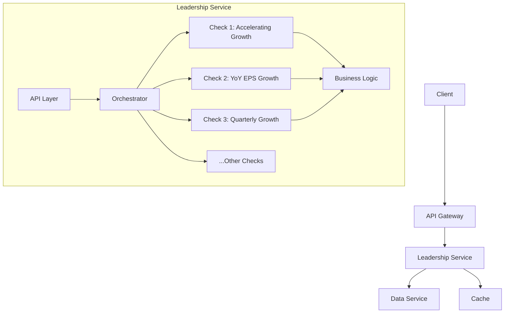

# Leadership Service Architecture

## Overview
The leadership service performs 10 leadership screening checks on stocks. The new architecture addresses fragmentation issues and integrates with the data-service for real financial data.

## System Architecture


## Key Components

### 1. API Endpoint
- **Endpoint**: `GET /leadership/<ticker>`
- **Parameters**: 
  - `ticker` (required): Stock symbol
- **Response**:
  ```json
  {
    "ticker": "AAPL",
    "results": {
      "accelerating_growth": true,
      "yoy_eps_growth": true,
      // ... other checks
    },
    "metadata": {
      "execution_time": 0.45
    }
  }
  ```

### 2. Service Integration
- **Data Service Integration**:
  - Uses gRPC for high-performance communication
  - Data contracts for:
    - Historical prices
    - Quarterly earnings
    - Annual reports
- **Cache Layer**:
  - Redis for memoizing frequent data requests
  - 5-minute TTL for financial data

### 3. Business Logic Layer
```python
class LeadershipChecks:
    def __init__(self, data_client):
        self.data_client = data_client
    
    def accelerating_growth(self, ticker):
        earnings = self.data_client.get_quarterly_earnings(ticker)
        # Implementation logic
        
    def yoy_eps_growth(self, ticker):
        # Implementation logic
        
    # ... other checks
```

### 4. Orchestration
```python
def run_checks(ticker):
    results = {}
    checks = LeadershipChecks(data_client)
    
    results['accelerating_growth'] = checks.accelerating_growth(ticker)
    results['yoy_eps_growth'] = checks.yoy_eps_growth(ticker)
    # ... other checks
    
    return results
```

## Data Flow
1. Client requests ticker analysis
2. API Gateway routes to leadership service
3. Service fetches required data from data-service
4. Orchestrator runs all 10 checks in parallel
5. Results aggregated and returned
6. Response formatted and cached

## Error Handling
- **Data Unavailable**: Return 503 with retry-after header
- **Invalid Ticker**: Return 400 with error details
- **Check Failure**: Partial results with error flags

## High-Level Implementation Plan

### Phase 1: Core Architecture
1. Create new endpoint in `app.py`
2. Implement gRPC client for data-service
3. Build `LeadershipChecks` class skeleton
4. Add Redis caching layer

### Phase 2: Business Logic
1. Implement 10 check methods with real data
2. Add input validation
3. Create parallel execution framework

### Phase 3: Testing & Deployment
1. Write integration tests
2. Update Dockerfile with new dependencies
3. Add Prometheus monitoring
4. Deploy to staging environment

### Required File Changes:
1. `backend-services/leadership-service/app.py` - New endpoint
2. `backend-services/leadership-service/leadership_logic.py` - Business logic
3. `backend-services/leadership-service/data_client.py` - gRPC client
4. `docker-compose.yml` - Add Redis service
5. `docs/leadership_service_architecture.md` - This document

## Dependencies
- gRPC for data service communication
- Redis for caching
- Prometheus for metrics