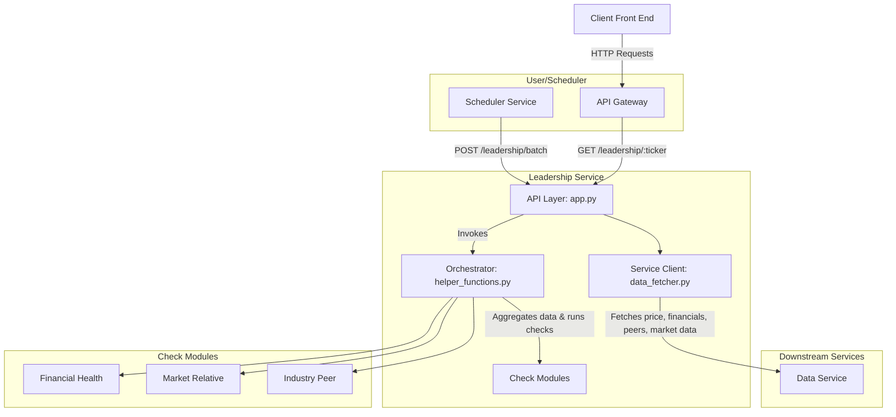

# Leadership Service Architecture

## 1. Overview

The leadership-service is a core component of the SEPA Stock Screener, responsible for evaluating individual stocks against a rigorous set of 10 leadership criteria inspired by Mark Minervini's trading principles. Its primary function is to act as a crucial filter in the screening pipeline, analyzing stocks that have already passed the initial Trend and VCP screens to identify true market leaders with strong fundamentals and superior relative strength.

The service operates on a "Just-in-Time" data retrieval model, fetching detailed financial, peer, and market data only when required for analysis, thus optimizing system resources and minimizing external API calls.

## 2. System Architecture & Data Flow

The service integrates seamlessly into the existing microservices ecosystem, acting as a downstream consumer of the data-service and an upstream provider for the scheduler-service and the public api-gateway.

### Data Flow:

1. **Request Initiation**: A request is initiated either by a user for a single ticker via the api-gateway (/leadership/:ticker) or by the scheduler-service for a batch of tickers (/leadership/batch).

2. **API Handling (app.py)**: The Flask application receives the request, performs initial input validation, and orchestrates the subsequent steps.

3. **Data Fetching (data_fetcher.py)**: The service's dedicated data client fetches all necessary data from the data-service in parallel, including core financials, historical prices, industry peers, and market trend context.

4. **Analysis Orchestration (helper_functions.py)**: The main analyze_ticker_leadership function receives the aggregated data. It systematically executes all 9 leadership checks.

5. **Logic Execution (checks/*.py)**: Each check is performed by a dedicated function within the appropriate module, returning a detailed pass/fail result with a descriptive message.

6. **Profile Evaluation**: The orchestrator evaluates the results against three predefined Leadership Profiles ("Explosive Grower," "High Potential Setup," "Market Favorite") using a two-tiered logic. A stock must pass 100% of the checks in at least one profile and at least one check in the other supporting profiles to achieve an overall pass.

7. **Response Aggregation**: The orchestrator compiles the results from all checks, the profile evaluation, and a summary message into a final JSON object, determines the overall passes status, and returns it to the API layer.

8. **Contract Validation**: Before sending the final HTTP response, the output data is validated against the formal Pydantic data contracts (LeadershipProfileSingle or LeadershipProfileBatch) to ensure system-wide data integrity.

## 3. Leadership Metrics Deep Dive
A stock is evaluated against 9 distinct metrics which are grouped into three Leadership Profiles. To be considered a leadership candidate, a stock must meet a two-tiered passing **Logic**:

**Primary Pass Condition**: Achieve a 100% pass rate on all criteria within at least one of the three profiles.

**Supporting Pass Condition**: For the remaining profiles, the stock must pass at least one criterion in each to show supporting characteristics.

### Profile 1: The "Explosive Grower" 🚀
Identifies companies with outstanding financial performance and momentum.

#### 1. Accelerating Growth (EPS, Sales, Margin)
**Logic**: True leaders show not just growth, but accelerating growth.
**Function**: check_accelerating_growth
**Implementation**: Calculates the Quarter-over-Quarter (QoQ) growth rates for Earnings, Revenue, and Net Margin for the last 3 quarters. Passes only if all three metrics show strictly increasing growth rates over this period. Capped or incalculable rates are handled gracefully.

#### 2. Strong YoY EPS Growth (>25%)
**Logic**: Demonstrates strong annual momentum in profitability.
**Function**: check_yoy_eps_growth
**Implementation**: Compares the most recent quarter's Earnings Per Share (EPS) to the same quarter from the previous year. Passes if the growth is greater than 25%. Growth rates are highlighted as "Standard," "High," or "Exceptional."

#### 3. Consecutive Quarterly Growth (>20%)
**Logic**: Indicates sustained, high-velocity growth in recent periods.
**Function**: check_consecutive_quarterly_growth
**Implementation**: Calculates the QoQ EPS growth for each of the last 4 quarters. Passes if all four quarters individually show growth greater than 20%.

#### 4. Positive Recent Earnings
**Logic**: The company must be profitable.
**Function**: check_positive_recent_earnings
**Implementation**: Checks if the EPS for both the most recent quarter and the last full fiscal year are positive.

### Profile 2: The "High-Potential Setup" 💡
Identifies companies with structural characteristics that often precede explosive price moves.

#### 5. Small to Mid-Cap ($300M–$10B)
**Logic**: Leadership profiles are typically found in companies with significant room for growth.
**Function**: check_is_small_to_mid_cap
**Implementation**: Checks if the company's marketCap is between $300 million and $10 billion.

#### 6. Early-Stage Company (≤10 Years Post-IPO)
**Logic**: Younger, innovative companies often exhibit the most explosive growth.
**Function**: check_is_early_stage
**Implementation**: Calculates the number of years since the company's ipoDate. Passes if the result is 10 years or less.

#### 7. Limited Float
**Logic**: A smaller supply of available shares (float) can lead to more powerful price moves when demand increases.
**Function**: check_has_limited_float
**Implementation**: Passes if the company's floatShares is less than 100 million, categorizing it as "Low" or "Medium" float.

### Profile 3: The "Market Favorite" ⭐
Identifies companies demonstrating leadership and attracting institutional attention.

#### 8. Market Trend Alignment
**Logic**: The stock's behavior should be strong relative to the overall market's condition.
**Function**: evaluate_market_trend_impact
**Implementation**:

- Determines Market Context: Classifies the current market as 'Bullish', 'Bearish', or 'Neutral' based on recent trend data.
- Conditional Checks:
  - In a Bearish market, it passes if the stock's decline from its 52-week high is shallower than the S&P 500's decline.
  - In a Bullish or Neutral market, it passes if the stock has recently made a new 52-week high, indicating leadership.
  - In a Recovery Phase (just after a market bottom), it passes if the stock makes a new high within 20 days of the market's turning point.

#### 9. Industry Leadership (Top 3 Rank)

**Logic**: A true leader must be one of the top performers in its specific industry.

**Function**: analyze_industry_leadership

**Implementation**:

- Fetches a list of the company's industry peers.
- Batch-fetches financial data for the company and all its peers.
- Ranks all companies on Revenue, Market Cap (as a proxy for market share), and Net Income.
- Calculates a combined score and a final rank. Passes if the company's final rank is in the top 3.

**Note**: The 10th metric, "Outperformance in Market Rally", is currently encompassed within the logic of the evaluate_market_trend_impact function, which checks for new highs during market recovery phases.