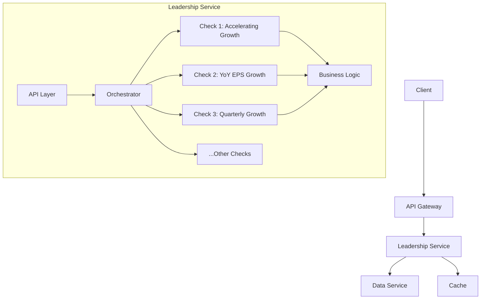

# Leadership Service Architecture

## Overview
The `leadership-service` evaluates stocks against 10 key leadership metrics derived from Mark Minervini's principles. A stock must pass all applicable metrics to qualify as a leadership profile. Market context (Bullish, Bearish, Neutral) influences conditional evaluations, with non-applicable metrics noted (e.g., "neglected due to market state"). Metrics exceeding base criteria are highlighted for exceptional performance.

## System Architecture


## Leadership Metrics

### 1. Fastest Earnings Growth
- **Ideal Logic**: Identify stocks with the fastest earnings growth, specifically Year-over-Year (YoY) quarterly Earnings Per Share (EPS) growth exceeding 25%. This indicates strong momentum and outperformance relative to prior periods.
- **Implementation**:  
  - **Function**: `check_yoy_eps_growth`  
  - **Screening Logic**: Requires at least 5 quarters of earnings data. Compares the most recent quarter's EPS to the same quarter from the previous year (4 quarters prior). Calculates growth as (current_eps - previous_year_eps) / previous_year_eps. Passes if >25%. Handles cases like negative/zero base EPS by failing the check.
  - **Highlights/Exceeds**: 
    - Categorizes growth levels:  
      - >45%: "Exceptional Growth"  
      - >35%: "High Growth"  
      - >25%: "Standard Growth"  
  - **Market State**: Independent.  
  - **Proxies/Notes**: Assumes data is newest-to-oldest.

---

### 2. Top 3 in Sales, Earnings, and Market Share  
- **Ideal Logic**: The stock should rank in the top 3 within its industry for sales (revenue), earnings (net income), and market share. This ensures the company is a leader among peers.
- **Implementation**:  
  - **Function** `check_industry_leadership`  
  - **Screening Logic**: Fetches industry peers via API, then batch-retrieves financial data (revenue, net income, market cap) for peers + the ticker. Filters out incomplete data, ranks using Pandas DataFrame on revenue, net income, and market cap (descending, with ties using 'min' method). Computes combined rank as sum of individual ranks. The ticker passes if its final rank (position in sorted DataFrame) is ≤3 out of ranked peers.
  - **Highlights/Exceeds**: Returns full ranked data for context, including total peers ranked.
  - **Proxy**: Uses market cap as a proxy for 'market share' as reliable, standardized market share data is difficult to acquire programmatically across all industries. Market cap serves as a strong indicator of a company's scale and influence within its sector. 
  - **Market State**: Independent.  

---

### 3. Outperformance in Market Rally  
- **Ideal Logic**: The stock should rise more than others in the early phase of a market rally, specifically outperforming the S&P 500 by >1.5x in percentage gain during the first 20 trading days of a new rally.
- **Implementation**:  
  - **Function** `check_outperforms_in_rally`  
  - **Screening Logic**: Requires at least 21 days of price data for both stock and S&P 500. Scans recent 180 days for a rally start (10% S&P 500 increase over 10 days). If found, compares performance over next 20 days: stock gain > (S&P 500 gain * 1.5). Fails if no rally, insufficient data, or non-positive S&P 500 performance. Aligns dates approximately if exact matches missing.   
  - **Proxies/Notes**: Price history is oldest-to-newest. Rally detection is proxy for "initial stages." If market state (from Metric 10) is not conducive to a rally (e.g., Bearish), this may be neglected with a comment like "neglected due to market state being 'Bearish'".
  - **Market State**: Neglect Bearish market state.
---

### 4. Sustained Quarterly EPS Growth  
- **Ideal Logic**: CDuring high-growth phases, the stock should show quarterly EPS growth of at least 20% for multiple consecutive quarters, indicating sustained acceleration.
- **Implementation**:  
  - **Function** `check_consecutive_quarterly_growth`  
  - **Screening Logic**: Requires at least 5 quarters of earnings data. Calculates QoQ growth for the last 4 quarters: (current_eps - next_eps) / abs(next_eps). Passes if all 4 rates >20%. Averages the rates for categorization.
  - **Highlights/Exceeds**: Categorizes average growth ('Exceptional Growth' >45%, 'High Growth' >35%, 'Standard Growth' >20%, 'Moderate Growth' otherwise) in details['consecutive_quarterly_growth_level'].
  - **Proxies/Notes**: Data newest-to-oldest. Handles negative/zero base by assigning 0 growth (fails). No market state dependency, but tied to "high-growth phases."
  - **Market State**: Independent.  

---

### 5. Positive Recent Earnings  
- **Ideal Logic**: The company should demonstrate solid fundamentals with positive earnings in recent periods, ensuring profitability.
- **Implementation**:  
  - **Function** `check_positive_recent_earnings`  
  - **Screening Logic**: Checks if the most recent annual EPS and quarterly EPS are both >0. Requires at least one annual and one quarterly earnings entry.
  - **Proxies/Notes**: Uses annual_earnings[0] and quarterly_earnings[0] (newest). 
  - **Market State**: Independent.  

---

### 6. Accelerating Growth in EPS, Sales, and Margin  
- **Ideal Logic**: Growth rates for EPS, revenue (sales), and net margin should be strictly increasing quarter-over-quarter for at least 3 quarters, showing acceleration.
- **Implementation**:  
  - **Function** `check_accelerating_growth`  
  - **Screening Logic**: Requires at least 4 quarters of earnings and financials data. Calculates QoQ rates for EPS, revenue, and net margin (Net Income / Total Revenue). Checks if rates[0] > rates[1] > rates[2] for all three metrics. Passes only if all accelerate.
  - **Proxies/Notes**: Data newest-to-oldest. Fails on zero/None values. 
  - **Market State**: Independent.  

---

### 7. Early-Stage Company (≤10 Years Post-IPO)  
- **Ideal Logic**: Leadership often emerges in younger companies, within 10 years post-IPO, when growth potential is high.
- **Implementation**:  
  - **Function** `check_is_early_stage`  
  - **Screening Logic**: Parses IPO date and checks if years since IPO <=10 (using current date). Fails if no IPO date or parsing error.
  - **Proxies/Notes**: Uses datetime for calculation, accounting for leap years (365.25).
  - **Market State**: Independent.   
---

### 8. Small to Mid-Cap ($300M–$10B)  
- **Ideal Logic**: Leadership profiles are typically small to mid-cap companies with room for growth, between $300M and $10B market cap.
- **Implementation**:  
  - **Function** `check_is_small_to_mid_cap`  
  - **Screening Logic**: Checks if marketCap is between MIN_MARKET_CAP ($300M) and MAX_MARKET_CAP ($10B). Fails if None or out of range.
  - **Market State**: Independent.  
---

### 9. Limited Float (≤20%)  
- **Ideal Logic**: Stocks with limited shares available for trading (low float) can experience rapid price movements, combined with small market cap.
- **Implementation**:  
  - **Function** `check_has_limited_float`  
  - **Screening Logic**: Calculates float percentage as floatShares / sharesOutstanding. Passes if <=20% (LIMITED_FLOAT_THRESHOLD). Fails if missing data or division issues.
  - **Proxies/Notes**: Focuses on limited float; small market cap is covered in Metric 8.
  - **Market State**: Independent.  
---

### 10. Market Trend Alignment  
- **Ideal Logic**: Evaluate the stock in context of the overall market trend: Bullish if all major indices (S&P 500, Dow Jones, NASDAQ) are above 50-day SMA; Bearish if all below; Neutral otherwise. Adjust stock evaluation based on this (e.g., shallow decline in Bearish markets, new highs/breakouts in Bullish/Neutral).
- **Implementation**:  
  - **Function** `check_market_trend_context` (determines state) + `evaluate_market_trend_impact` (evaluates stock behavior)
  - **Screening Logic**:
    - **Trend Detection**:  
      - Bullish: All indices >50-day SMA.  
      - Bearish: All indices <50-day SMA.  
      - Neutral: Mixed.  
    - **Stock Checks**:  
      - Bearish: Decline ≤2.5x S&P 500’s decline from 52-week high.  
      - Bullish/Neutral: New 52-week high or breakout (price >1.05x avg, volume >1.5x avg) if in recovery phase (recent Bearish trends present). 
  - **Highlights/Exceeds**: Stores sub-results (e.g., shallow_decline, new_52_week_high, recent_breakout).
  - **Proxies/Notes**: Uses ^IXIC for NASDAQ. Requires 52-week data. If state doesn't match a sub-check, neglect and comment (e.g., "neglected due to market state being 'Bullish'"). Price history oldest-to-newest.

---

## Technical Notes  
- **Data Order**: Assumes newest-to-oldest for earnings, oldest-to-newest for price history.  
- **Proxies**: Market cap for market share;
- **Error Handling**: Fails gracefully on missing/zero data.  

## API Endpoint
- **Endpoint**: `GET /leadership/<ticker>`
- **Parameters**: 
  - `ticker` (required): Stock symbol
- **Response**:
  ```json
  {
    "ticker": "AAPL",
    "passes": true,
    "results": {
      "consecutive_quarterly_growth_level": true,
      "has_accelerating_growth": true,
      // ... other checks
    },
    "metadata": {
      "execution_time": 0.45
    }
  }
  ```

## Data Flow
1. Client requests ticker analysis
2. API Gateway routes to leadership service
3. Service fetches required data from data-service
4. Orchestrator runs all 10 checks sequentially 
5. Results aggregated and returned

## Error Handling
- **Data Unavailable**: Return 503
- **Invalid Ticker**: Return 400 with error details
- **Check Failure**: Return 500
